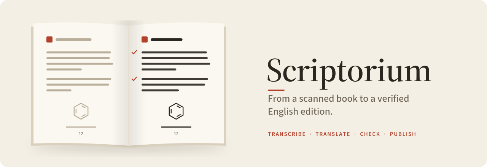

<picture>
  <source media="(prefers-color-scheme: dark)" srcset="assets/banner-dark.svg">
  
</picture>

# Scriptorium

**Turn a scanned book into a verified, readable English edition, with Claude doing the careful work and scripts
checking every step.**

You bring a PDF. Scriptorium helps you and [Claude Code](https://claude.com/claude-code) do the rest:

- **transcribe** every page exactly: tables, footnotes, references and figures included;
- **translate** it (or check the translation you bring) paragraph by paragraph;
- **check** that nothing got lost: every number, reference, figure and paragraph has to survive, or the check fails;
- **publish** a reading site with the original one click away, full-text search in both languages, and light, paper
  and dark themes, plus PDF and Markdown editions.

It was built on a 1,000-page German chemistry monograph, so it takes figures seriously: chemical structures and
reaction schemes can be redrawn from blind double readings. It works just as well for a novel or a history book, where
you simply skip those parts.

## Install

You need macOS or Linux with Python 3.11+, Node 20+ and Poppler.

```sh
brew install poppler node ghostscript tesseract     # or your package manager
git clone https://github.com/Laboratoriet/scriptorium.git
./scriptorium/install.sh
```

This installs the `scriptorium` command (short form: `scrip`) and checks your setup.

## Five minutes to a first book

```sh
mkdir ~/Books && cd ~/Books
scriptorium new ~/Downloads/scan.pdf    # a few questions: title, language, rights
cd my-book
scriptorium next                        # always tells you what to do next
```

Then open Claude Code in the book's folder and say **"let's continue the book"**. The book's `CLAUDE.md` tells
Claude how to work: it runs `scriptorium next`, uses the right brief for each step, and checks its own work.

## Everyday commands

| Command | What it does |
|---|---|
| `scriptorium new [scan.pdf]` | Start a book |
| `scriptorium next` | Inspect the book and name the next step |
| `scriptorium status` | Progress per chapter |
| `scriptorium check [unit]` | Run the checks: references, and the translation against the original |
| `scriptorium build [unit]` | Update the reading site |
| `scriptorium preview` | Open the reading site in your browser |
| `scriptorium pdf [a4 \| a5 \| bilingual \| all]` | Print the edition to PDF |
| `scriptorium export [unit]` | English Markdown |

Power users and agents also have `brief`, `docs`, `tools`, `run <tool>`, `python` and `doctor`. See
`scriptorium help`.

## How it works

```
scan.pdf → page images → transcription → joined chapters → translation → checks → review → site, PDF
                           (per page)       (seams checked)                (every     (independent
                                                                           number)    reader + fixer)
```

- **Checks, not trust.** Scripts verify each step before the next one starts: page seams, reference lists,
  and the translation's numbers, references, figures and paragraph count against the original.
- **Two blind readers** for anything interpretive, like a chemical structure or a reaction scheme. A script compares
  their readings and you only resolve the disagreements.
- **Your decisions stick.** Hand-edited figures are `locked`, and decisions are logged with dates.
- **One kit, many books.** Every book is its own folder; fixes to the tools reach every book.

The full road map is in [`docs/WORKFLOW.md`](docs/WORKFLOW.md). The hard-won rules are in
[`docs/LESSONS.md`](docs/LESSONS.md), and every tool is listed in [`docs/TOOLS.md`](docs/TOOLS.md).

## Rights

Translation is a derivative work. Claude translates books that are **public domain, your own, licensed, or used with
permission**. For any other book, bring your own English (yours, DeepL's, a translator's) and Scriptorium checks,
reviews and publishes it. Editions stay on your machine unless the rights say otherwise. `scriptorium new` asks about
this up front.

## License

[MIT](LICENSE). Scriptorium's code and docs, not the books you make with it.
